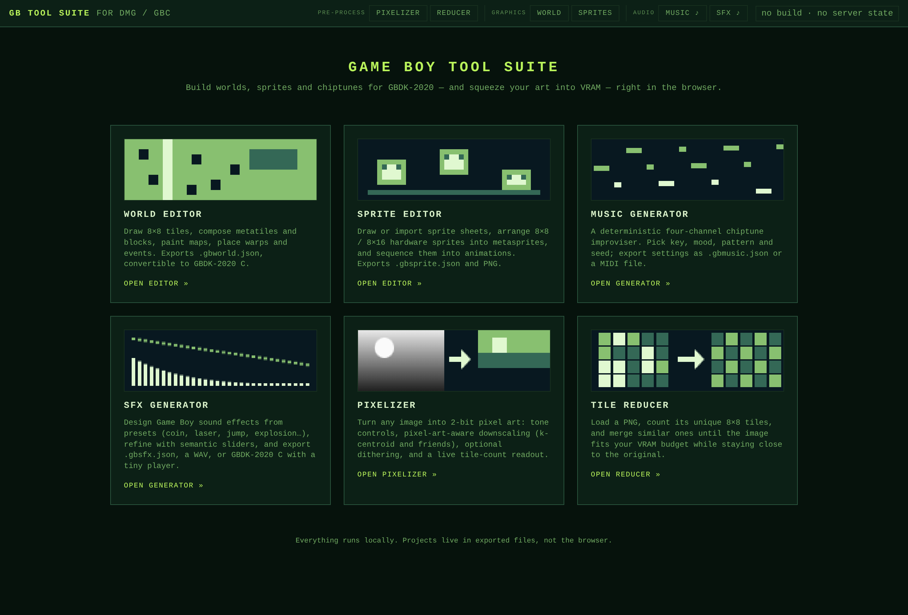
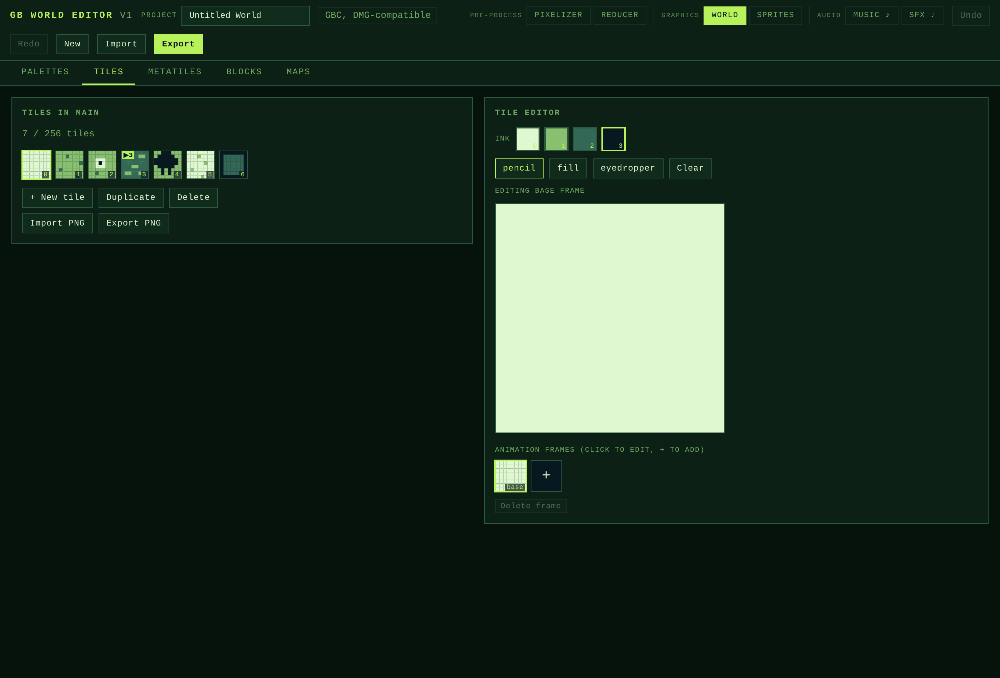
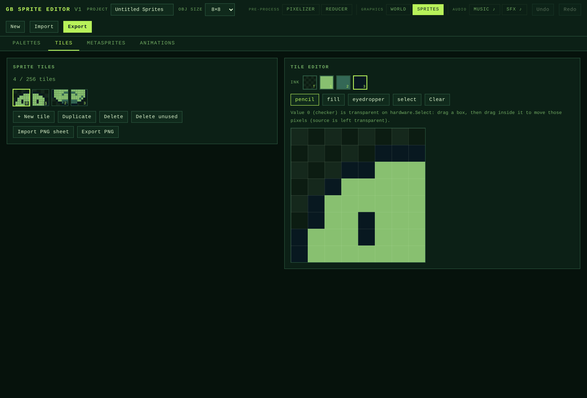
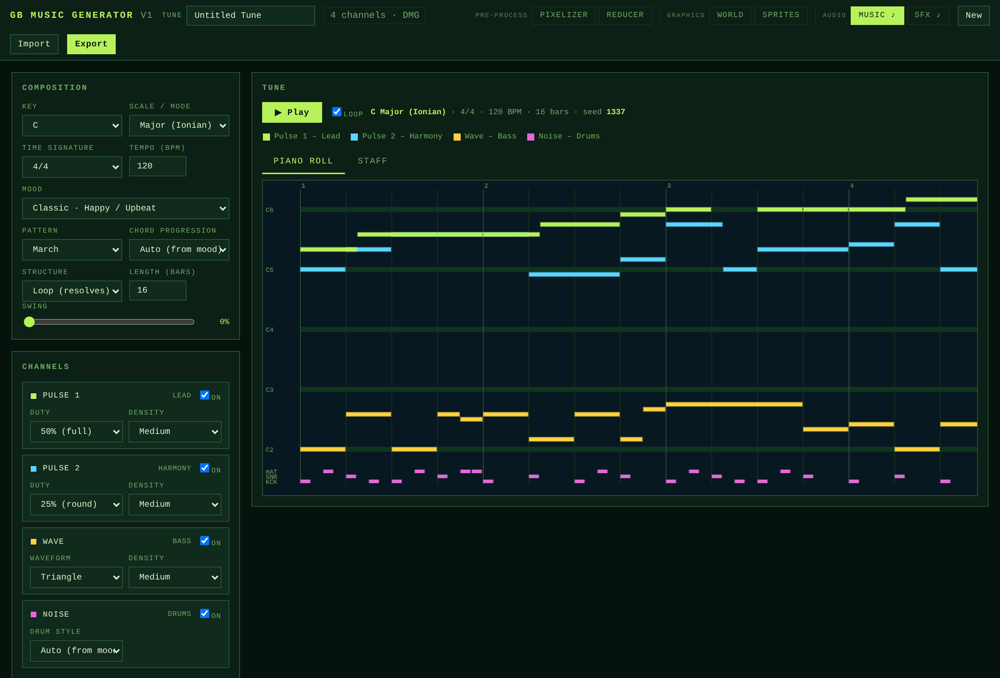
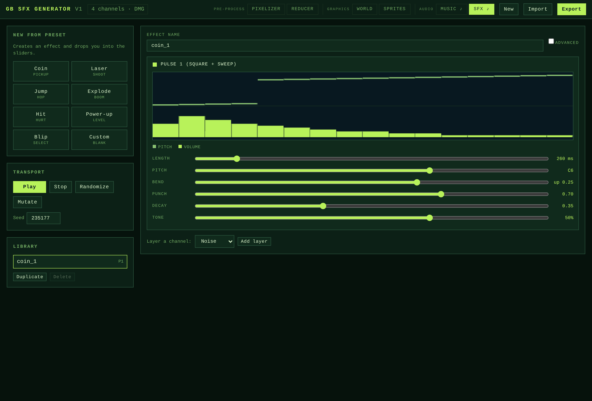
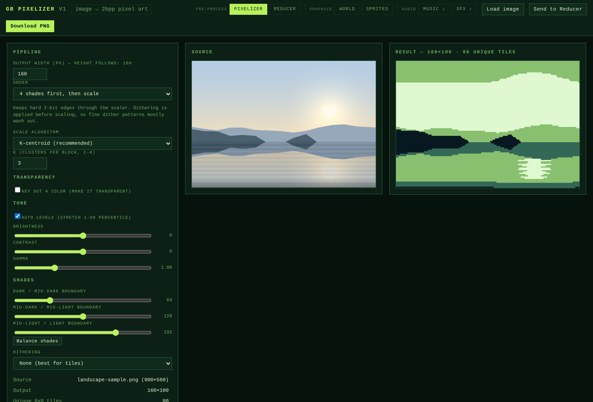
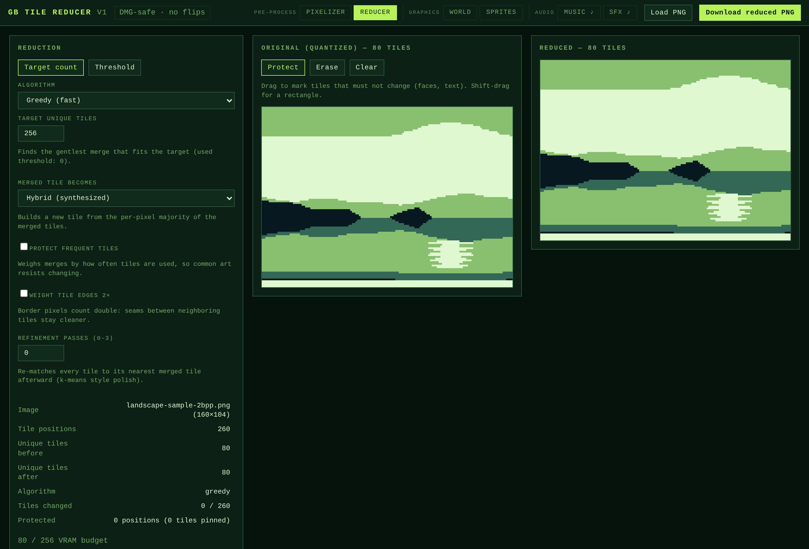

# GB Tools

Six browser-based Game Boy authoring tools, plus the command-line tooling around
them. Every tool is a single self-contained HTML page with no build step —
vanilla JS, served as static files, running entirely in the browser. Nothing is
uploaded anywhere and there is no browser storage: every project is saved and
loaded through explicit Export/Import so a page behaves identically served
locally or from a preview. A themed landing page (`docs/index.html`) links them
all and each tool cross-links to the others.

Everything targets the original **DMG** Game Boy: four shades of gray, a 256-tile
VRAM budget, and no hardware tile flipping on backgrounds. The tools share those
constraints (see [Shared design constraints](#shared-design-constraints)) so art
authored in one flows losslessly into the next.



## The tools

### World Editor

Author Pokémon-style Game Boy worlds (tiles → metatiles → blocks → maps, with
connections and an events layer) and export them to GBDK-2020 C. See the
[World Editor guide](markdown/WORLD_EDITOR.md).



### Sprite Editor

Author Game Boy OBJs from the hardware up: draw or import 8×8 tiles, arrange 8×8 /
8×16 hardware sprites into **metasprites** (with per-object H/V flip and OAM
priority), and sequence metasprites into **animations** timed in 60 Hz ticks. It
models the real OBJ rules — one global sprite size, value 0 always transparent,
the OBP0/OBP1 palette registers with a per-part register choice and live DMG
preview, mirrored tiles reused for free — and its "draw on frame" workflow recompiles a
free-hand drawing back into deduplicated tiles. Exports `.gbsprite.json` and PNG
that round-trips losslessly. See the
[Sprite Editor guide](markdown/SPRITE_EDITOR.md).



### Music Generator

A deterministic chiptune improviser for the four GB channels that exports settings
and Standard MIDI. See the [Music Generator guide](markdown/MUSIC_GENERATOR.md).



### SFX Generator

A sfxr-style sound-effect designer for the four GB channels. Start from a preset
(coin, laser, jump, explosion, hit, power-up, blip), refine with a handful of
semantic sliders (length, pitch, bend, punch, decay, tone), and stack layers
across channels. Effects are reproducible from a seed, and one compiled per-frame
program drives the preview, the WAV render, and the export alike. Exports a
`.gbsfx.json` bank, a WAV, or GBDK-2020 C with a tiny frame-stepped player
(`gbsfx_init` / `gbsfx_play` / `gbsfx_update`). See the
[SFX Generator guide](markdown/SFX_GENERATOR.md).



### Pixelizer

Turn any image into 2-bit pixel art. Tone controls (auto-levels, brightness,
contrast, gamma) feed a pixel-art-aware downscaler (k-centroid, dominant, box, or
nearest), then quantization to the four DMG shades with an optional chroma key and
dithering. The two lossy steps can run in either order, and a live unique-tile
readout previews the VRAM cost. The PNG re-imports losslessly into the World and
Sprite editors, or hands straight to the Tile Reducer. See the
[Pixelizer guide](markdown/PIXELIZER.md).



### Tile Reducer

Load a PNG, count its unique 8×8 tiles, and merge similar ones until the image
fits a VRAM budget while staying close to the original. Two clusterers (fast
greedy, higher-quality agglomerative), tunable merge behavior, and protected
regions for art that must survive untouched (faces, text, logos). Mirrored tiles
are deliberately kept distinct, since DMG backgrounds can't flip, so counts stay
honest. See the [Tile Reducer guide](markdown/TILE_REDUCER.md).



## How the tools fit together

The tools are separate pages, but they're designed to hand off to each other
because they all speak the same 4-shade, 8×8-tile language:

- **Art → tiles.** Drop a photo or drawing into the **Pixelizer**, then **Send to
  Reducer** to squeeze it under the tile budget, then import the PNG into the
  **World** or **Sprite** editor. Every PNG in this chain quantizes to the same
  four values, so each hop is lossless.
- **World → ROM.** The **World Editor** exports a `.gbworld.json`, and the
  `tools/` scripts turn it into GBDK-2020 C or a stitched preview PNG.
- **Audio.** The **Music** and **SFX** generators export MIDI / WAV for previewing
  and GBDK-2020 C (SFX) for the ROM. Music files store only settings + seed, so a
  tune regenerates identically on import.

## Shared design constraints

Every tool honors the DMG hardware limits, which is what keeps the handoffs
lossless:

- **Four shades only.** Images quantize to the same luminance buckets everywhere
  (alpha reads as the lightest shade), so a PNG re-imports identically.
- **256-tile VRAM budget.** Each tileset stays ≤ 256 tiles; animated tiles reserve
  one slot each. The Pixelizer and Tile Reducer show a live count against it.
- **No background tile flipping.** DMG can't mirror BG tiles, so mirrored tiles
  count as separate tiles — mirror by drawing a new tile. (Sprites *can* flip per
  object, and the Sprite Editor uses that.)
- **8-bit index ceiling.** Tile / metatile / block / map counts each stay ≤ 255;
  the world converter warns when a count is exceeded.

## Guides

Each tool has an end-user guide in [`markdown/`](markdown/):

- [World Editor](markdown/WORLD_EDITOR.md) · [Sprite Editor](markdown/SPRITE_EDITOR.md)
- [Music Generator](markdown/MUSIC_GENERATOR.md) · [SFX Generator](markdown/SFX_GENERATOR.md)
- [Pixelizer](markdown/PIXELIZER.md) · [Tile Reducer](markdown/TILE_REDUCER.md)
- [Developer handoff](markdown/DEVELOPER_HANDOFF.md) — `.gbworld.json` schema, the
  generated C structures, and GBDK-2020 runtime integration.

## Structure

```
dmg-world-builder/
├── docs/                          # the apps + landing page (served over HTTP)
│   ├── index.html                 # landing page linking every tool
│   ├── gb-world-editor.html       # the world editor
│   ├── gb-sprite-editor.html      # the sprite editor
│   ├── gb-music-generator.html    # the music generator
│   ├── gb-sfx-generator.html      # the sfx generator
│   ├── gb-pixelizer.html          # the pixelizer
│   ├── gb-tile-reducer.html       # the tile reducer
│   ├── gb-theme.css               # shared DMG design tokens + components
│   ├── gb-common.js               # shared DOM/form helpers
│   └── screenshots/               # README screenshots
├── markdown/
│   ├── WORLD_EDITOR.md            # world editor guide
│   ├── SPRITE_EDITOR.md           # sprite editor guide
│   ├── MUSIC_GENERATOR.md         # music generator option reference
│   ├── SFX_GENERATOR.md           # sfx generator guide
│   ├── PIXELIZER.md               # pixelizer guide
│   ├── TILE_REDUCER.md            # tile reducer guide
│   └── DEVELOPER_HANDOFF.md       # JSON schema, C structures, integration guide
├── worlds/                        # example projects (test.gbworld.json)
├── .devcontainer/
└── README.md
```

The apps live in `docs/` so the suite can be published straight to GitHub Pages
(serve from the `docs/` folder). When published, the landing page is the site root.

## Quick start

The pages are static, but they link the shared `gb-theme.css` / `gb-common.js`, so
they **must be served over HTTP** — opening a `.html` via `file://` won't load the
shared assets.

### With VS Code Dev Containers (recommended)

Open this folder in VS Code and choose **Dev Containers: Reopen in Container**. A
static server (Live Server) starts automatically on port 5500.

### Without Docker

Serve the repo root with anything static:

```bash
python3 -m http.server 8000
# landing page:     http://localhost:8000/docs/
# world editor:     http://localhost:8000/docs/gb-world-editor.html
# sprite editor:    http://localhost:8000/docs/gb-sprite-editor.html
# music generator:  http://localhost:8000/docs/gb-music-generator.html
# sfx generator:    http://localhost:8000/docs/gb-sfx-generator.html
# pixelizer:        http://localhost:8000/docs/gb-pixelizer.html
# tile reducer:     http://localhost:8000/docs/gb-tile-reducer.html
```

Every tool runs entirely in the browser; the server only delivers the files.

## World tooling

The World Editor's **Export** saves your project as a `.gbworld.json` (the single
source of truth). The `.gbworld.json` → GBDK C converter (`gbworld_to_c.py`) ships
with the game engine that consumes the data, and world PNG rendering is built into
the editor (Maps panel → Export world PNG). See
[markdown/DEVELOPER_HANDOFF.md](markdown/DEVELOPER_HANDOFF.md) for the JSON schema,
the generated C structures, and a GBDK-2020 integration walkthrough.
